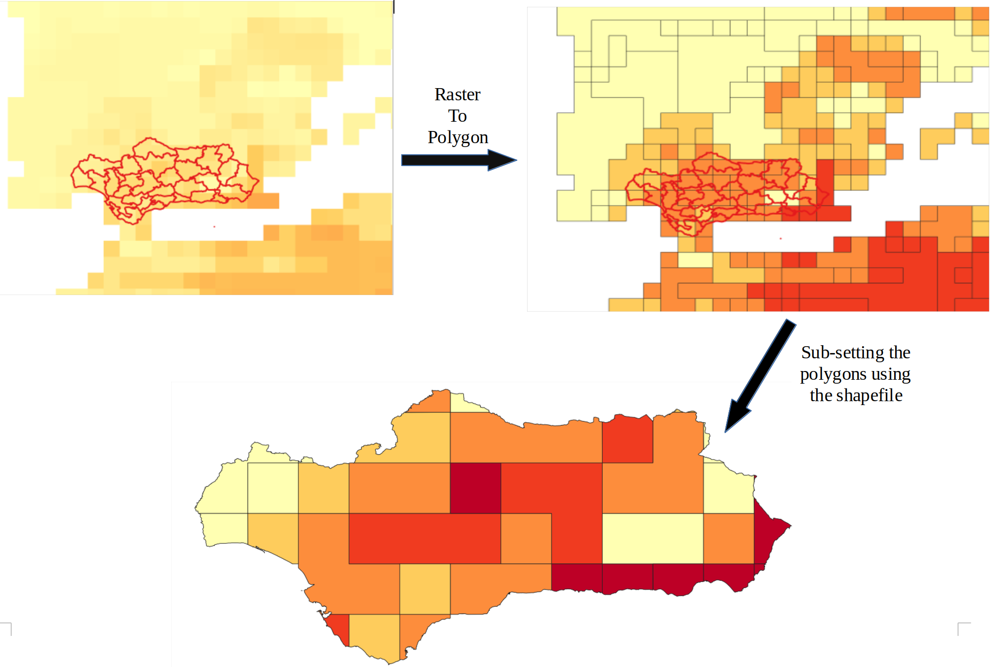

# SubsetNetCDF  
Subsetting NetCDF data using a shapefile.
The NC data is the consecutive maximum number of summer days (seasonal- Also you can check the metadeta of the netcdf in the NC Metadata File).
The shapefile here used is the Andalucia Region, Spain. 
There are two possible ways to subset the nc data using the shapefile.
- If the raster pixels are very large, we can upsample the data. In this case 1 pixel becomes 10 x 10 = 100 pixels. This also results in datasize increase (from 68kb to 26mb) 
- Converting raster to vector (raster to polygon conversion)  
   - To get smooth curves on the boundary of the shapefile. 
 

